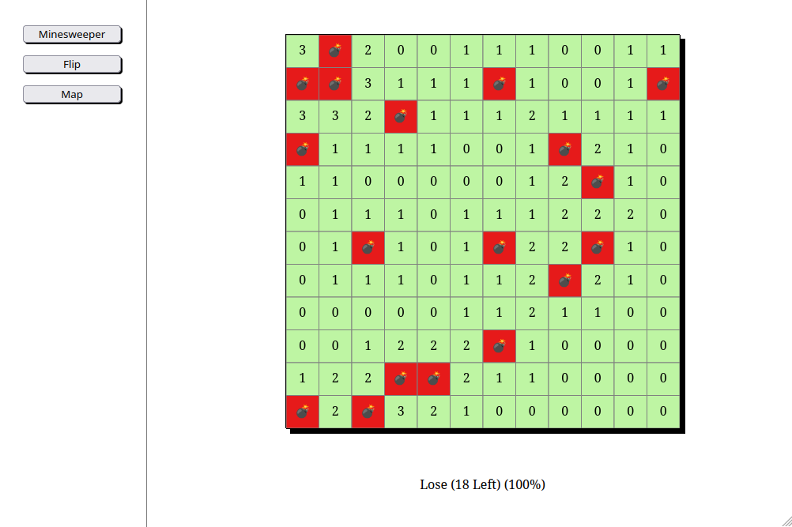
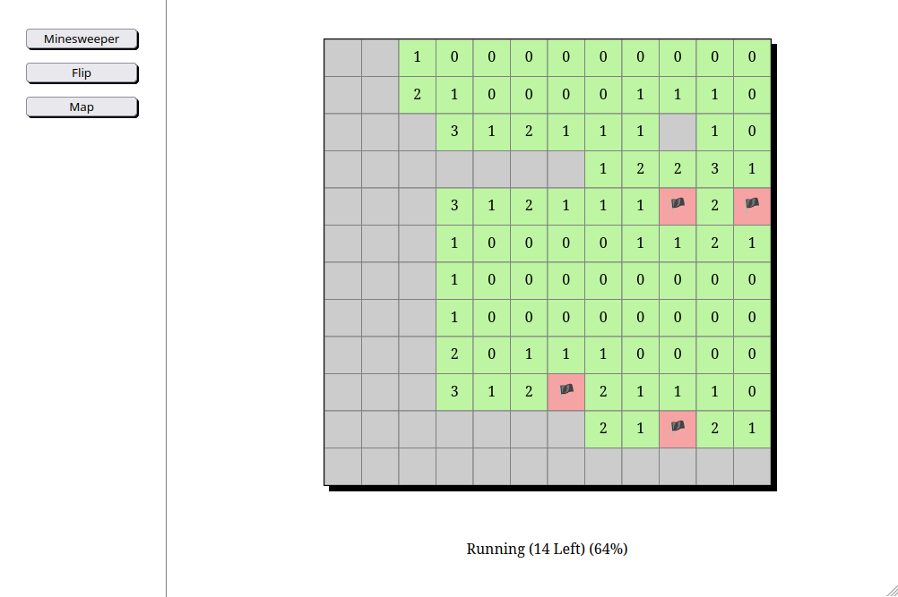
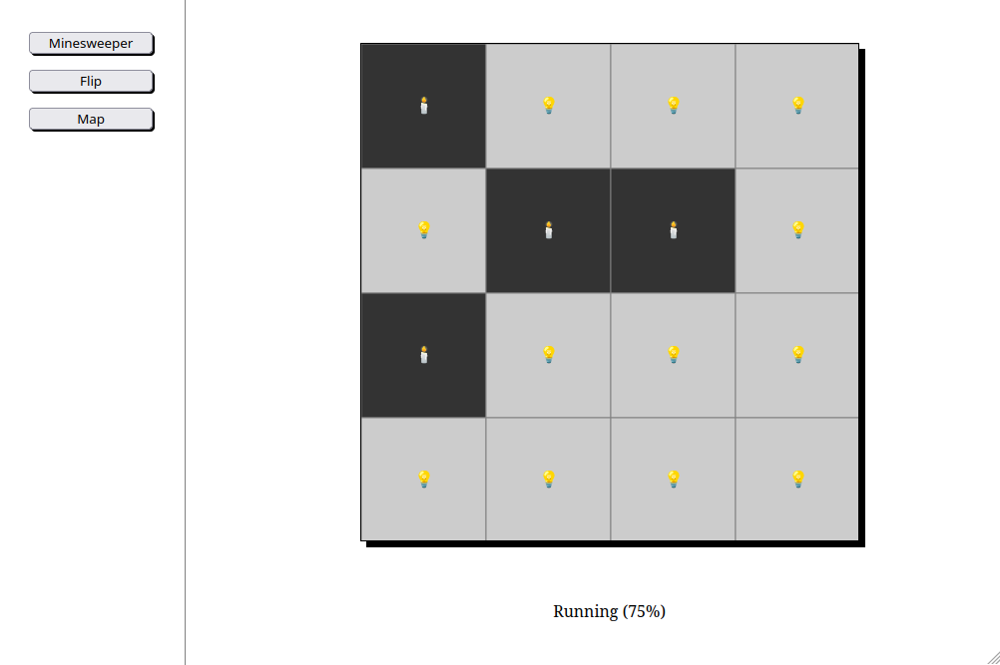
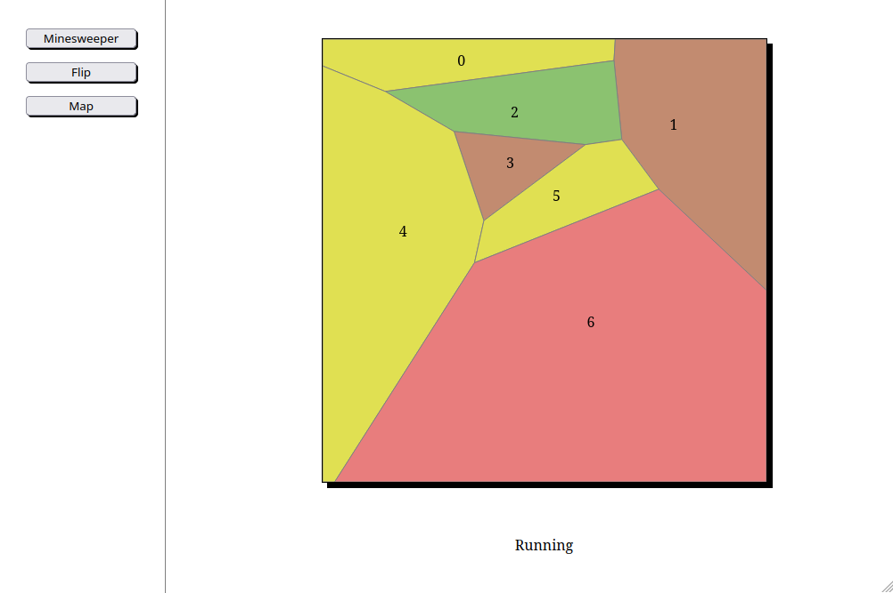

[=== Something awesome's coming === working on this! ===]

# algorithms-and-complexity-client
Matricola VR457811 - Progetto d'esame AA 2024/2025

## Obiettivo
L'obiettivo è creare un client in js che possa gestire tanti giochi diversi tra loro. Il client deve essere agnostico sulle logiche di gioco e sui componenenti grafici del gioco stesso e deve dipendere completamente dal server. Un'altra richiesta per il progetto è stato l'utilizzo di javascript vanilla: niente frameworks come Vue o Angular o di librerie grafiche complesse come d3.

Il sito da cui è stata presa l'ispirazione per i giochi è il seguente:
https://www.chiark.greenend.org.uk/~sgtatham/puzzles/

Sono attualmente implementati tre giochi, scelti per mostrare differenti potenzialità del progetto:
- Flip: un gioco semplice per un'implementazione semplificata
- Minesweeper: un gioco algoritmicamente più elaborato e con due diversi tipi di eventi, ma sempre a tassellamento regolare
- Map: un gioco con un tassellamento irregolare

Ogni gioco verrà descritto più avanti in maniera più approfondita.
Da un punto di vista più algoritmico, le parti interessanti sono:
- Minesweeper contiene un algoritmo di ricerca, utilizzato per espandere l'area scoperta nel caso l'utente clicchi su una cella contenente il valore 0. In tal caso, infatti, non viene scoperta solo la cella cliccata ma tutta l'area di 0 tra loro adiacenti, comprensivo del bordo formato da celle con valori diversi da 0
- Map contiene una tassellatura di Voronoi, creata tramite il Fortune's algorithm. Maggiori dettagli si possono trovare più avanti in questa relazione. Siccome il Fortune's algorithm fornisce non i poligoni ma una lista dei confini tra essi, è poi stato completato con un algoritmo che a partire dai lati individua e costruisce i poligoni

Al momento non esiste un server e le comunicazioni con esso sono simulate tramite la chiamata, qualunque sia il gioco selezionato, di due specifiche funzioni dotate di un'interfaccia standard uguale per tutti i giochi.
Per eseguire il codice è sufficiente, quindi, avere un qualunque server che esponga i file a partire dalla root di questo repository: si può usare l'estensione `live server` di vscode, il modulo httpserver di python (con `python3 -m http.server`) o qualunque altro modo.

## Idea di base per il client
L'idea di base per l'implementazione è di gestire il rendering lato client principalmente tramite un elemento che consenta di visualizzare tutti gli oggetti legati al gioco ed i relativi eventi, inizialmente di tipo canvas ma poi sostituito con uno di tipo svg (vedi paragrafo dedicato). Questo svg viene aggiornato dopo aver ricevuto dal server un nuovo stato della partita in corso. Lo stato di una partita comprende concettualmente tre componenti:
- gli oggetti da disegnare
- gli eventi da catturare
- lo stato della partita

Lo stato della partita contiene informazioni basilari come la fase (Running/Win/Lose), un valore che indica il progresso (significativo in alcuni giochi, ad esempio in minesweeper per indicare la percentuale del campo di gioco già mostrato), un testo aggiuntivo (contenente ad esempio il numero di mine ancora da trovare, sempre in minesweeper).

## Canvas vs SVG

Nell progetto è stata inizialmente implementata una gestione che verteva su un elemento `<canvas>` ma è stato convertito per l'utilizzo di un elemento `<svg>`. La valutazione che ha portato a questa scelta si basa sulle caratteristiche dei giochi da implementare. Il canvas è una sorta di lavagna su cui disegnare liberamente: questo è comodo per i giochi che richiedono un framerate elevato e per effetti grafici e scene molto dinamiche. L'svg, invece, permette di avere un DOM strutturato in cui le entità grafiche sono degli oggetti del DOM, di cui è possibile manipolare le caratteristiche come posizione e dimensioni e su cui è possibile catturare gli eventi senza alcuna necessità di effettuare calcoli per comprendere se un click all'interno dell'area di disegno ricade o meno, da un punto di vista logico, all'interno di un certo oggetto. Questo calcolo, inoltre, è semplice da implementare per oggetti quadrati o circolari ma può diventare molto complesso per oggetti dalla forma irregolare. L'utilizzo di un svg permette di preservare l'oggetto grafico come entità, con i vantaggi che ne derivano, mentre il canvas è una superficie piatta su cui tutti gli oggetti grafici diventano un tutt'uno.

Ricapitolando, questi sono vantaggi e svantaggi delle due soluzioni:

Canvas (la prima soluzione implementata):\
✅ Alto framerate \
✅ Possibilità di implementare effetti grafici\
❌ Appiattimento degli oggetti durante il rendering\
❌ Individuazione manuale degli oggetti che ricevono un evento di click\
❌ Gestione complessa di un eventuale aggiornamento parziale della schermata di gioco

SVG (l'attuale soluzione implementata):\
✅ Mantenimento degli oggetti di gioco come entità\
✅ Facilità di agganciamento dei listener sui singoli elementi di gioco\
✅ Facilità di mantenimento degli oggetti che non mutano durante un aggiornamento\
❌ Minori prestazioni durante un aggiornamento dell'intero campo di gioco\
❌ Difficoltà di implementazione di effetti grafici, in particolare particellari o legati ai colori

## Stateful vs stateless

Nell'implementazione della comunicazione tra server e client si è dovuto scegliere tra due filosofie differenti, che possiamo indicare, dal punto di vista del server, con i seguenti nomi:
- Stateful
- Stateless

### Stateful

Seguendo questa filosofia, il server può tenere traccia dello stato del gioco per ogni giocatore attualmente attivo. I vantaggi di questa strategia sono principalmente due:
- Le comunicazioni tra client e server riguardano i soli cambiamenti da applicare al gioco in quando lo stato del gioco è conosciuto da entrambi in ogni momento
- I giochi possono essere multigiocatore, in quanto il server fa da coordinatore, raccoglie ed applica gli input degli utenti ad un unico stato di gioco che distribuisce a tutti i client coinvolti in una partita

Di contro, con questa filosofia si hanno i seguenti svantaggi:
- Il server deve mantenere in memoria dei dati per ciascun giocatore connesso, con conseguente occupazione di memoria
- Il server deve capire quando un giocatore interrompe la partita chiudendo il proprio browser ed implementare dei meccanismi per la liberazione della memoria da partite rimaste in sospeso
- Minore resistenza a bug di comunicazione o implementazione: client e server potrebbero divergere nell'applicazione dei cambiamenti di stato alla partita a causa di bug

### Stateless

Seguendo questa filosofia, il server non tiene traccia in alcun modo dello stato della partita. Al momento della creazione di una nuova partita esso invia al client un oggetto contenente sia gli oggetti grafici per il gioco sia eventuali informazioni legate allo stato della partita stessa. Ad ogni mossa del giocatore, il client reinvia al server lo stato completo e quest'ultimo, dopo aver applicato sullo stato appena ricevuto le logiche di gioco, reinvia al client uno stato di gioco aggiornato.

I vantaggi di questa filosofia sono i seguenti:
- Il server non ha alcuna occupazione di memoria al di fuori del momento in cui sta elaborando una risposta per un client. Non servono logiche di pulizia per eventuali partite sospese, non è necessario limitare il numero di partite contemporanee
- Server e client sono sempre ben allineati sullo stato del gioco in quanto esso viaggia avanti ed indietro in maniera completa ad ogni passaggio

Gli svantaggi sono i seguenti:
- Il client riceve uno stato di gioco che contiene anche informazioni nascoste al giocatore, giocatore che potrebbe analizzare le comunicazioni ed accedere a tali informazioni
- Maggiore payload nelle comunicazioni, in quanto non viaggiano solo gli aggiornamenti ma ogni informazione legata al gioco ed alla sua UI

## Rappresentazione degli oggetti grafici del gioco

Per quanto riguarda la rappresentazione degli oggetti del gioco, come per la scelta tra canvas e svg, il progetto è stato inizialmente implementato in un modo ma col procedere degli sviluppi si è proceduto ad un refactoring per aumentare l'elasticità della soluzione.

### Prima versione
L'implementazione iniziale vedeva gli oggetti rappresentati tramite delle coordinate all'interno di un tavolo considerato a scacchiera: il server inviava quindi la definizione del tavolo di gioco come una coppia di valori pari al numero di righe ed al numero di colonne in cui dividere il tavolo ed ogni oggetto aveva, tra le proprie caratteristiche, una posizione definita come coppia di coordinate che rappresentassero la cella di destinazione.

### Seconda versione (attuale)
Nell'implementazione corrente gli oggetti vengono descritti tramite liste di coordinate dei vertici, questo consente di avere forme irregolari se necessario.
L'eventuale testo dell'oggetto viene visualizzato al centro del rettangolo che si ottiene con la funzione `HTMLelement.getBBox()`, che restituisce un rettangolo che circoscrive l'intero poligono. Questa logica funziona bene per poligoni regolari, come quadrati o rettangoli, ma anche per poligoni irregolari che mantengono una forma convessa e con vertici che hanno distanze dal baricentro non troppo differenti. È possibile, come evolutiva, implementare un algoritmo più complesso e costruire una funzione di calcolo del baricentro della figura.
Si è comunque mantenuta la presenza delle coordinate `x` ed `y` per gli oggetti in quei giochi che hanno un tavolo di gioco a scacchiera, non ai fini del rendering ma come supporto per i calcoli di vicinanza tra le celle. Queste coordinate non sono quindi più coordinate grafiche, legate alla dimensione del tavolo di gioco in pixel, ma indici di riga e colonna.

Ogni oggetto di gioco ha inoltre un id ed un oggetto interno chiamato `internalData`, che il client non utilizza, necessario per il server nelle comunicazioni che aggiornano lo stato di gioco. Questo oggetto può contenere, ad esempio, le coordinate delle celle nel caso di un gioco con una disposizione a scacchiera, ma anche informazioni sul contenuto di una cella nascosta all'utente o altro.

## Posizionamento delle eventuali scritte all'interno dei poligoni

Anche qui durante lo sviluppo sono stati effettuati dei cambiamenti.

### Prima versione
Una prima versione utilizzava il centro del rettangolo contenente il poligono. Tale rettangolo può essere ottenuto dal DOM tramite la funzione `getBBox` definita per qualunque `SVGGraphicsElement`, cioé qualunque elemento facente parte di un `svg`.

### Seconda versione
Una prima miglioria è stata implementare il calcolo del centro geometrico, calcolato come la media delle coordinate di tutti i vertici. Questo metodo è semplice e veloce da applicare e funziona bene per oggetti dalla forma regolare o quasi regolare, non é però ottimale per oggetti che hanno vertici a distanze molto diverse tra loro dal centro, ad esempio in presenza di un vertice "sparato lontano" od un poligono concavo con un vertice molto vicino al centro.

### Terza versione (attuale)
L'ultima evoluzione è stata quindi il calcolo del centroide, cioé il centro geometrico. Si tratta di un calcolo un poco più complesso, che tiene in considerazione anche il concetto di area e che consente di ottenere un buon posizionamento del testo anche con poligoni dalla forma molto irregolare.

# Minesweeper
Si tratta di una riproduzione del famoso gioco incluso in Windows fin da Windows 95 e chiamato "Campo minato" o "Prato fiorito" a seconda delle versioni. In questo progetto lo chiameremo col nome inglese "minesweeper".

## Funzionamento generale
Nel caso qualcuno sia appena arrivato da Marte: si parte con una griglia rettangolare in cui tutte le celle sono nascoste ed il gioco consiste nello scoprire tutte le celle che non contengono una mina. Ogni cella, quando viene scoperta, mostra il numero di celle contenenti mine tra le 8 celle che confinano con essa. E' inoltre possibile marcare con una bandierina le celle in cui si è convinti che ci sia una mina, così da ricordarsene e non rischiare di scoprire la relativa cella per distrazione.
Cliccando con il tasto destro su una cella coperta la si marca con la bandierina, e cliccando col tasto destro su una bandierina la si rimuove.
Cliccando col sinistro su una cella coperta oppure con la bandierina, la si scopre. Una volta coperta non è più possibile interagire con essa.

## Vittoria e progressione
La progressione di gioco è calcolata come il rapporto tra le celle diverse dallo stato iniziale (quindi scoperte, oppure con una bandierina) sul totale delle celle. Quando la progressione di gioco è al 100% viene assegnata la vittoria. Nel caso venga invece scoperta una cella con una mina viene assegnata la sconfitta.

## Algoritmo di espansione
[Qui inserirò la descrizione dell'algoritmo di espansione]
Sono partito dall'idea dell'algoritmo A*, ma rimuovendo i concetti di punto d'arrivo, di priorità e di punteggio, implementando quindi sostanzialmente un algoritmo di tipo "region growing", modificato per l'utilizzo specifico in questo gioco.
L'idea dell'algoritmo che viene avviato a partire dallo scoprire una cella con valore zero da parte dell'utente è la seguente:
- Si crea una lista, chiamata frontiera, contenente solo il nodo cliccato
- Si crea una lista, inizialmente vuota, che ospiterà i nodi visitati
- Iterando finché la frontiera non è vuota:
  - Si rimuove un nodo dalla frontiera
  - Si valutano tutti i suoi vicini:
    - Se un nodo è già stato valutato, cioè é contenuto nella lista dei nodi visitati, viene ignorato
    - Se un nodo contiene una mina, viene ignorato
    - Se un nodo ha valore maggiore di zero, si scopre e si aggiunge alla lista dei nodi visitati
    - Se un nodo ha valore zero, si scopre e si aggiunge alla frontiera

L'ordine di estrazione dei nodi dalla frontiera è ciò che decide se la visita dell'albero è di tipo BFS, DFS o casuale, tuttavia non ha alcuna importanza ai fini dell'espansione dell'area visualizzata visto che il gioco viene aggiornato in maniera atomica una volta finita l'espansione.

Con questo semplice algoritmo si migliora notevolmente l'esperienza del giocatore in quanto le parti interessanti del gioco riguardano l'individuazione delle mine ed espandere manualmente un'area coperta da valori zero è semplicemente ripetitivo.

# Flip

## Funzionamento generale
Lo scopo di questo gioco riuscire ad accendere tutte le celle. Il campo è infatti composto da una griglia di celle ed ogni cella può avere due stati:
- spenta: sfondo scuro, icona di candela
- accesa: sfondo chiaro, icona di lampadina accesa

Ogni volta che si clicca su una cella vengono invertiti gli stati della cella stessa e delle quattro celle posizionate sopra, a destra, sotto e a sinistra di essa. Dal punto di vista algoritmico, questo gioco non presenta sfide particolari.

## Vittoria e progressione
La vittoria viene assegnata semplicemente verificando che tutte le celle siano accese, la progressione di gioco è il rapporto tra il numero di celle accese ed il numero di celle totali.

# Map
## Funzionamento generale
Lo scopo di questo gioco è colorare le diverse aree facendo in modo che due aree confinanti siano colorate con due colori differenti.
Una colorazione con quattro colori è sempre possibile, qualunque sia la forma e la relazione di ciascuna area nei confronti delle altre aree, come conseguenza del teorema dei quattro colori, formulato in teoria dei grafi come "ogni grafo planare è 4-colorabile" e caso specifico di un più generale problema di colorazione. Esiste una formula per stabilire il numero minimo di colori necessari per colorare una superficie chiusa, se applicata ad una superficie piana si ottiene un numero pari, appunto, a quattro. Da un punto di vista algoritmico, questo gioco pone delle sfide non durante la partita del giocatore ma nella preparazione iniziale della stessa: doveva essere trovato un modo per generare in maniera casuale una mappa di gioco con delle aree dalla forma irregolare, che coprissero l'intero campo di gioco, tenendo anche traccia delle adiacente tra le aree. Si è scelto di utilizzare un tassellamento di tipo Voronoi.

## Vittoria e progressione
Ad ogni turno, l'applicazione verifica che per ogni coppia di adiacenze le due aree della coppia siano colorate con colori differenti. Non esiste un valore di progressione, in questo caso, né una situazione di sconfitta: l'utente può provare e riprovare finché non riesce a trovare la soluzione.

## Vonoroi [TODO]
[Qui descriverò cos'è il Voronoi]
Dato un insieme di punti scelti, chiamati solitamente `seed`, il tassellamento di voronoi suddivide lo spazio in aree in cui ogni punto è più vicino al `seed` di tale area che a qualunque altro `seed`.
Esistono differenti metodi per generare un tassellamento di questo punto. Una soluzione naive è calcolare, punto per punto, qual é il `seed` più vicino. Questa soluzione è molto pesante computazionalmente e non risolve il problema del conoscere le adiacenze tra le varie aree. Tra gli algoritmi più efficienti c'è il Fortune's algorithm, applicato in questo progetto e spiegato qui di seguito.

### Fortune's algorithm [TODO]
Il Fortune's algorithm è un algoritmo che permette di costruire un diagramma di Voronoi in 2D con una complessità di tempo O(n log n) e di spazio O(n), si tratta di un algoritmo di tipo "sweep line".
L'algoritmo simula una linea orizzontale che scende dall'alto verso il basso e mentre questa scende si aggiorna una mappa temporanea della parte di diagramma già calcolata.

Gli elementi chiave dell'algoritmo sono i seguenti:
- Sweepline: come già accennato, è una linea che attraversa l'intera area
- Events queue: contiene tutti gli eventi ancora da processare, che possono essere di due tipi:
  - Site event, quando la sweepline raggiunge un nuovo punto
  - Circle event: quando un arco si restringe fino a sparire, ovvero quando tre siti formano un cerchio raggiunto dalla sweepline
- Beach line: una struttura che tiene traccia degli archi parabolici attivi in un dato momento
L'output dell'algoritmo è la lista di segmenti del diagramma di Voronoi

Lungo l'attraversamento del campo di gioco da parte della sweepline i due tipi di eventi vengono così gestiti:
- Site event: si aggiunge un nuovo arco nella beach line e si controlla poi se l'inserimento ha generato dei nuovi circle events
- Circle event, ovvero la sparizione di un arco: quando tre archi consecutivi della beachline sono tangenti ad un cerchio e la sweepline raggiunge il fondo di tale cerchio, si ha un circle event. In questo caso, si aggiunge un nuovo segmento al diagramma, un arco sparisce e si verifica se come conseguenza di ciò si crea un nuovo circle event da gestire

### Completamento tassellamento [TODO]
[Qui descriverò la parte che dal risultato del Fortune's porta all'avere i poligoni]