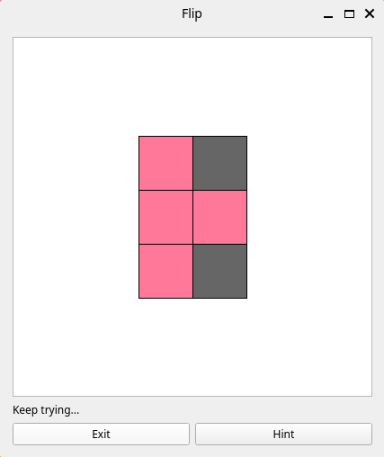
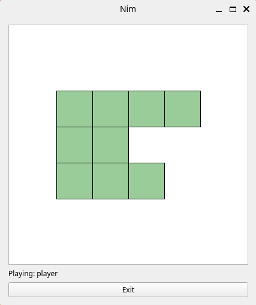
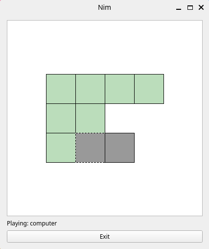
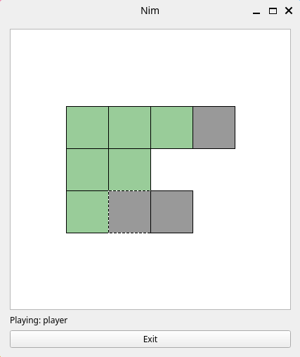

# algorithms-and-complexity-client
Matricola VR457811 - Progetto d'esame AA 2024/2025

## Obiettivo
Creare alcuni giochi costituiti da una parte client ed una parte server. La parte server deve essere eseguita nel sistema rtal.

I giochi da implementare sono i seguenti:
- [x] Flip
- [x] Nim
- [ ] Labirinto percorribile su corridoi o bordi

## Istruzioni per l'esecuzione

### venv

E' necessario aver installato la libreria PyQt. Se lo si desidera si può utilizzare venv per non dover installare la libreria a livello globale sulla propria macchina.

| what to do      | cmd            |
|-----------------|----------------|
|Creazione venv:  | python -m venv |
|Activate: source | ./bin/activate |
|Installazione PyQt | python3 -m pip install PyQt5 |


### Exec

Se si può utilizzare rtald il comando dovrebbe assomigliare a questo:

```rtal connect nim -aboard="4 2 3" -- nim/services/game_ui.py```
```rtal connect flip -an=2 -am=3 -aseed=34 -- flip/services/game_ui.py```

In assenza di rtald, è possibile avviare utilizzando il file orchestrator.py:

```python orchestrator.py nim```

Questo script si occupa di eseguire parallelamente game-ui.py e [game]/play.py agganciando in maniera incrociata i rispettivi stdin ed stdout, simulando così il funzionamento di rtald. Questo sistema è stato usato nelle prime fasi di sviluppo, potrebbe essere necessaria qualche correttiva per farlo funzionare ancora.

# Librerie

E' stata utilizzata un'unica libreria per la parte grafica, chiamata PyQt.

## Flip

Questo gioco viene avviato col seguente comando:

```rtal connect flip -an=2 -am=3 -aseed=465 -- flip/services/game_ui.py```

I parametri che è possibile passare sono le dimensioni della griglia di gioco, chiamati `n` ed `m`, ed un `seed` che viene usato per la generazione dello stato iniziale della partita. Nessuno di questi parametri è obbligatorio: per `n` ed `m` è previsto un default pari a 5, come `seed` viene invece usato un valore casuale.

L'interfaccia di gioco prevede la griglia di elementi cliccabili e due tasti funzione: il tasto **Exit** per la chiusura "pulita" dell'applicazione sia lato server che lato client ed il tasto **Hint** che mostra un suggerimento evidenziando in giallo una delle celle da cliccare secondo una soluzione trovata.

Un altro elemento presente a video è un testo informativo che indica quando il gioco è concluso.



### Solver / richiesta suggerimento

Una ricerca per esplorazione, ad esempio A*, è tecnicamente implementabile per questo gioco ma non è indicato. Il numero di stati possibili, infatti, è 2^N con N il numero di celle del gioco. Naturalmente, con un N molto piccolo non è un problema ma concettualmente si trova di una soluzione con complessità esponenziale e quindi altamente inefficiente.

Un approccio migliore esiste ma richiede un po' di ragionamento di tipo matematico: si tratta di risolvere il seguente sistema.
A·x = b mod 2

Vediamo i diversi elementi di questo sistema:
- A è la matrice delle mosse
- b è un vettore rappresentante lo stato attuale del gioco
- x è un vettore rappresentante le celle da cliccare per risolvere il gioco

#### Matrice A

Per capirne bene la composizione, utilizziamo un esempio ed immaginiamo una griglia 2x2 con soli 0:
0 0
0 0
La rappresentazione lineare (concatenando le diverse righe) è 0,0,0,0.

Se clicchiamo sulla cella in alto a sinistra, la matrice diventa
1 1
1 0
La rappresentazione lineare ora è 1,1,1,0.

Ogni riga della matrice A contiene degli 1 nelle celle che cambiano valore alla pressione della cella corrispondente a tale riga, rimanendo sull'esempio per una griglia 2x2:
1, 1, 1, 0    -> le celle che cambiano premendo quella in posizione 0
1, 1, 0, 1    -> le celle che cambiano premendo quella in posizione 1
1, 0, 1, 1    -> le celle che cambiano premendo quella in posizione 2
0, 1, 1, 1    -> le celle che cambiano premendo quella in posizione 3

La dimensione della matrice A è quindi NxN con N=n*m

#### Vettore b

Il vettore b rappresenta la situazione attuale del campo di gioco.

Se la situazione iniziale del gioco è
1 0
0 0
Abbiamo che il vettore b è 1,0,0,0

La dimensione di b è quindi n*m.


#### Vettore x

Il vettore x rappresenta la soluzione e conterrà degli 1 in corrispondenza delle caselle che è necessario cliccare per risolvere il gioco.
Il concetto di ordine non è presente nella soluzione perché l'ordine il cui vengono cliccate le celle durante il gioco è indifferente. Lo stato di ciascuna cella viene infatti invertito ogni volta che essa o una delle celle confinanti vengono cliccate: se il numero di tali azioni è pari la cella torna nello stato iniziale, se è dispari la cella termina nello stato opposto. Questo spiega anche il ```mod 2``` visibile nella formula.
La dimensione di x è quindi n*m.

#### A·x

Completando l'esempio, affiancando la matrice A con il vettore b otteniamo
1, 1, 1, 0, 1
1, 1, 0, 1, 0
1, 0, 1, 1, 0
0, 1, 1, 1, 0

#### Risoluzione

Applicando il [metodo di gauss](https://it.wikipedia.org/wiki/Metodo_di_eliminazione_di_Gauss) riduciamo la matrice in una forma a gradini e poi, tramite _back subsitution_, troviamo i valori che costituiscono il vettore x, cioé troviamo quali celle devono essere cliccate per raggiungere una soluzione.

## Nim

Questo gioco viene avviato col seguente comando:

```rtal connect nim -aboard="4 2 3" -- nim/services/game_ui.py```

L'unico parametro accettato è `board`, consistente in una stringa che contiene numeri interi. Ogni numero è l'altezza della pila di monete.

Graficamente, il gioco viene visualizzato come serie di righe in cui ogni riga ha un numero di celle pari al numero di monete corrispondente. L'interfaccia comprende anche un tasto **Exit** per la chiusura "pulita" dell'applicazione sia lato server che lato client che un testo che informa su chi abbia il turno.

Le celle di un verde acceso indicano le monete ancora presenti nella pila a cui appartengono e sono elementi cliccabili, le celle grigie indicano le monete già rimosse e non sono più cliccabili. Quando il turno è del computer le celle verdi sono colorate con un colore meno acceso e non rispondono al click. L'evento di click scatena la rimozione della moneta cliccata e di tutte le eventuali monete ancora presenti a destra di essa.





### Intelligenza del giocatore-computer

L'idea alla base di questo metodo consiste nel calcolare lo XOR bit a bit tra i numeri delle monete presenti in ciascuna pila: `num = pila1 ^ pila2 ^ ...`.
Se `num` è pari a 0 il giocatore a cui tocca in quel momento è in una posizione di svantaggio, in caso contrario il giocatore corrente è in una posizione di vantaggio. Il motivo è che l'operazione di XOR agisce come una sorta di bilanciamento delle rappresentazioni in binario dei numeri: se il risultato è 0 il gioco è bilanciato, se è diverso da zero il giocatore può effettuare una mossa per bilanciare il gioco.

Più in dettaglio, bisogna capire quante monete rimuovere e da quale pila. Consideriamo il bit più significativo di `nim_num`: se in posizione `n` abbiamo un bit a 1, significa che almeno una (o tre, o cinque, eccetera) pile hanno quel bit impostato a 1. Rimuovendo un numero di monete dato dal numero binario che ha come unico bit a 1 quello in posizione `n`, abbiamo rimosso lo sbilanciamento dei bit lasciando all'altro giocatore una situazione in cui il `nim_num` è pari a 0.
Se `nim_num` è pari a 0, però, non c'è alcun bit più significativo su cui ragionare. In questo caso rimuoveremo da una pila tutte le monete eccetto una.

#### Misère mode
Esiste una variante chiamata `misère`, in cui chi prende l'ultima moneta perde anziché vincere. Il calcolo della mossa, in questa modalità, rimane identico finché la situazione non vede la presenza di massimo una pila con più di una moneta. In questo caso specifico, si conta il numero di pile con una moneta sola: se questo numero è multiplo di due, si rimuovono tutte le monete dall'eventuale riga con più di una moneta, in caso contrario si rimuove l'unica moneta da una delle pile con una moneta sola.